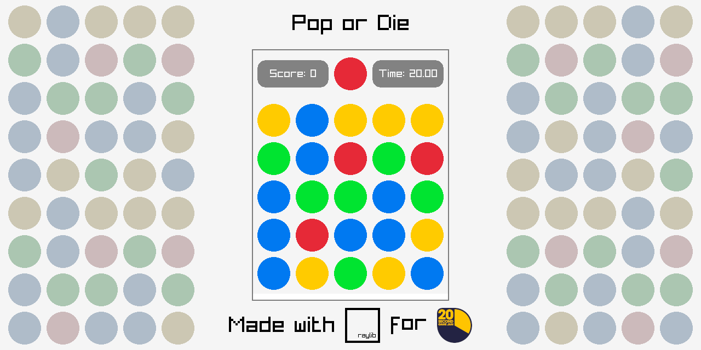

## Pop or Fail

### Description

Simple game written in C using [Raylib](https://raylib.com) for [20 Second Game Jam](https://itch.io/jam/20-second-game-jam)
You have to pop the circles that match the color of the circle at the top.

### Screenshots
 

### Developers

 - [degradka](https://github.com/degradka) - UI, Game logic
 - [mamalord](https://github.com/mamalord) - Code optimization, Game logic

### Links

 - github.com Releases: [github.com Releases page](https://github.com/degradka/pop-or-fail/releases)
 - itch.io Release: [itch.io Game Page](https://www.youtube.com/watch?v=dQw4w9WgXcQ)

### Building the game

For the build you will need to build and install `raylib`, `gcc` and `make` libraries

#### Building for GNU/Linux

- `git clone https://github.com/degradka/pop-or-fail.git` clones the repo
- `cd pop-or-fail/src` cds to the source directory
- `make` builds the game
- `./pop-or-fail` runs the game

---
### License

This game sources are licensed under an unmodified zlib/libpng license, which is an OSI-certified, BSD-like license that allows static linking with closed source software. Check [LICENSE](LICENSE) for further details.
